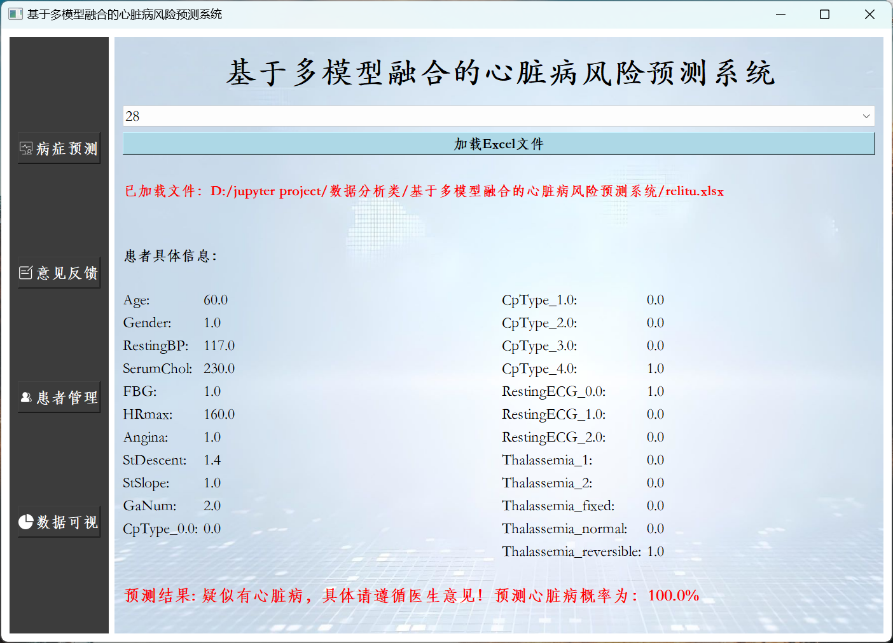
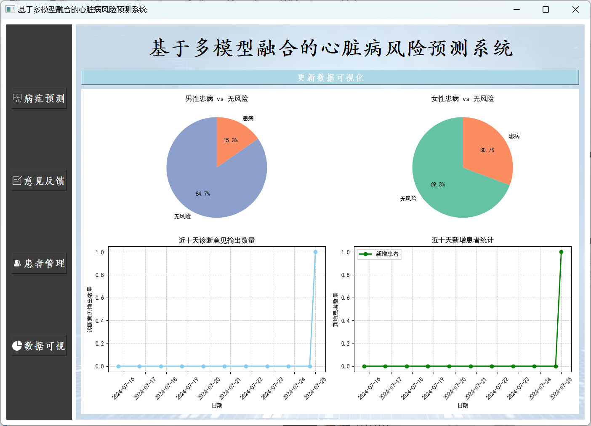
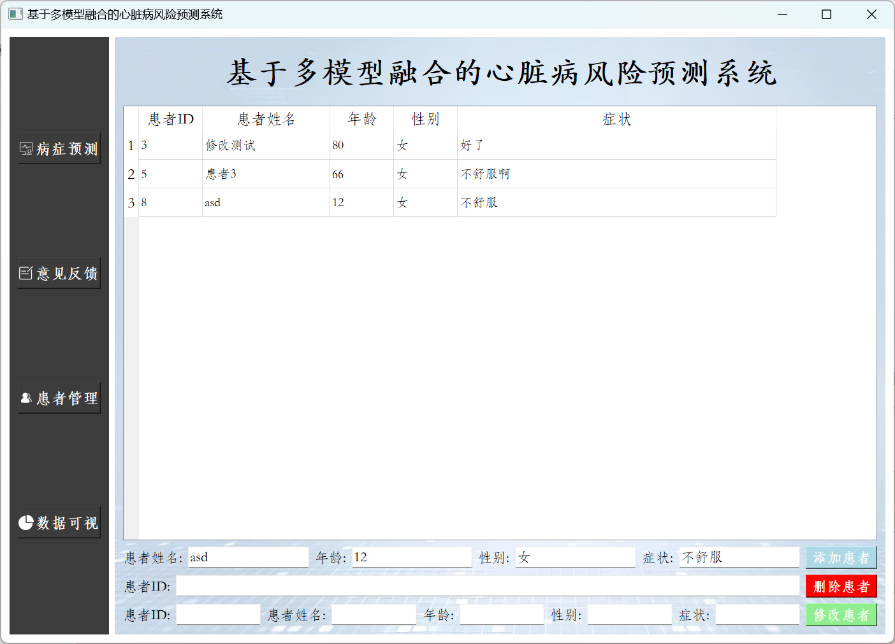
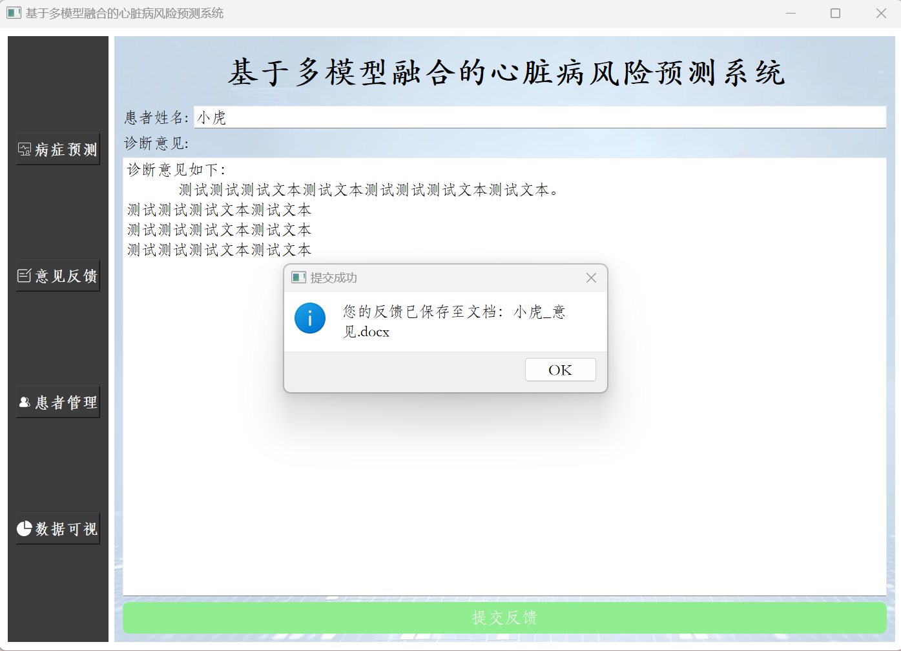
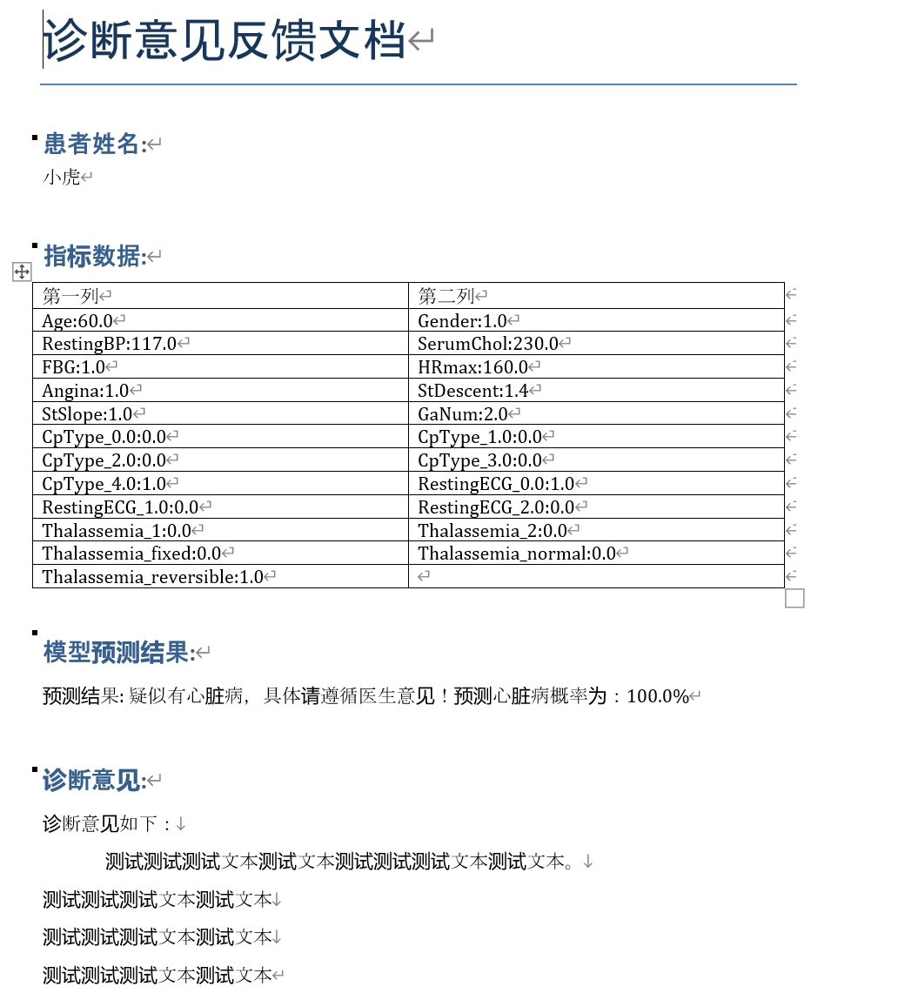
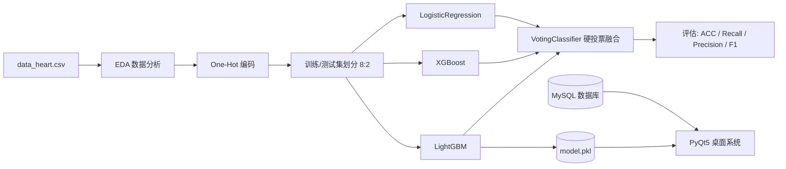

# 基于多模型融合的心脏病风险预测系统


> 集成 **LightGBM + XGBoost + 逻辑回归**，通过投票机制融合预测结果的心脏病风险预测桌面系统。

本系统将机器学习建模与桌面应用开发相结合：使用集成学习（VotingClassifier）融合三种异构模型的预测能力，并通过 PyQt5 构建图形化操作界面，支持**病症预测、患者管理、诊断意见反馈、数据可视化**四大功能模块，预测与患者数据持久化存储于 MySQL 数据库。

## 系统预览

| 病症预测 | 数据可视化 |
| :---: | :---: |
|  |  |
| **患者管理** | **意见反馈（自动生成 Word 报告）** |
|  |  |

诊断意见反馈模块会自动生成包含患者指标、模型预测结果与医生意见的 Word 文档：



## 功能特性

- 🔮 **病症预测**：加载 Excel 格式的患者指标数据（支持 One-Hot 编码后的特征），选择记录后一键预测，实时展示风险结论与概率
- 👥 **患者管理**：患者信息的增、删、改、查，数据持久化存储于 MySQL
- 📝 **意见反馈**：填写诊断意见后，自动生成结构化 Word 报告（`{患者姓名}_意见.docx`），并入库留痕
- 📊 **数据可视化**：男女患病比例饼图、近十天诊断意见输出趋势、近十天新增患者统计，一键刷新
- 🔐 **登录校验**：基于 MySQL 的管理员账号登录

## 模型与技术路线

系统在 `notebooks/` 中完成数据分析、特征工程、模型训练与评估全流程：

1. **探索性数据分析（EDA）**：年龄分布直方图、患病比例饼图、分类特征分布、箱型图、相关性热力图
2. **特征工程**：对 `CpType`（胸痛类型）、`RestingECG`（静息心电图）、`Thalassemia` 等分类变量做 One-Hot 编码
3. **基模型**：LightGBM、XGBoost、逻辑回归
4. **模型融合**：`VotingClassifier(voting='hard')` 对三个基模型进行硬投票集成
5. **评估体系**：Accuracy / Recall / Precision / F1，并对四个模型进行对比可视化



> 说明：`models/model.pkl` 为训练得到的 LightGBM 模型；复现融合模型（Voting Ensemble）的训练与对比评估请运行 `notebooks/heart_disease_multi_model_analysis.ipynb`。

### 评估指标说明

| 指标 | 含义 | 适用场景 |
| --- | --- | --- |
| Accuracy | 正确预测样本占比 | 类别分布相对平衡 |
| Recall | 真实正例被正确识别的比例 | 医疗场景更关注"漏诊率" |
| Precision | 预测为正例中真实正例的比例 | 评估误报成本 |
| F1 Score | Precision 与 Recall 的调和平均 | 综合权衡两者 |

## 快速开始

### 1. 环境要求

- Python 3.8+
- MySQL 5.7+ / 8.0
- Windows（GUI 使用 SimHei 等中文字体渲染图表，推荐 Windows 运行）

### 2. 安装依赖

```bash
git clone https://github.com/zhongyanghan/Heart-disease-risk-prediction-system-based-on-multi-model-fusion.git
cd Heart-disease-risk-prediction-system-based-on-multi-model-fusion
pip install -r requirements.txt
```

### 3. 初始化数据库

使用 root 账号执行初始化脚本（创建 `heart_disease_prediction` 库及三张表，并写入默认账号）：

```bash
mysql -u root -p < sql/init.sql
```

如需自定义数据库连接，可设置环境变量（不设置则使用默认值）：

| 环境变量 | 默认值 |
| --- | --- |
| `HEART_DB_HOST` | `localhost` |
| `HEART_DB_USER` | `root` |
| `HEART_DB_PASSWORD` | `123456` |
| `HEART_DB_NAME` | `heart_disease_prediction` |

### 4. 启动系统

```bash
python app/main.py
```

使用默认账号 **`admin` / `123456`** 登录即可进入系统。

### 5. 复现模型训练（可选）

将数据集 `data_heart.csv`（见下文"数据集说明"）置于仓库根目录，然后运行 `notebooks/heart_disease_multi_model_analysis.ipynb` 全部单元格，即可复现数据分析、模型训练、评估对比与 `model.pkl` 导出。

## 项目结构

```text
.
├── app/
│   ├── main.py                                  # PyQt5 桌面系统入口
│   └── assets/                                  # 可选资源：背景图 beijng.jpg、图标 m1~m4.png
├── data/
│   └── README.md                                # 数据集获取与字段说明
├── docs/
│   ├── 项目介绍.docx                             # 项目背景 / 技术路线 / 创新点完整文档
│   └── screenshots/                             # 系统截图
├── models/
│   └── model.pkl                                # 训练好的 LightGBM 模型
├── notebooks/
│   └── heart_disease_multi_model_analysis.ipynb # 数据分析 + 建模 + 系统开发全过程
├── sql/
│   └── init.sql                                 # MySQL 初始化脚本
├── LICENSE
└── requirements.txt
```

## 数据集说明

训练数据 `data_heart.csv` 未随本仓库分发，请自行获取后放置于仓库根目录（供 notebook 训练复现使用；运行桌面系统只需仓库自带的 `models/model.pkl`）。字段构成见 [data/README.md](data/README.md)。

## 可选资源配置

系统的登录页/主页背景图与左侧按钮图标为可选项，放置于 `app/assets/` 即可生效：

| 文件 | 用途 |
| --- | --- |
| `beijng.jpg` | 登录页与各功能页背景图 |
| `m1.png` ~ `m4.png` | 左侧导航按钮图标（病症预测 / 意见反馈 / 患者管理 / 数据可视） |

资源缺失时程序自动跳过图片加载，不影响任何功能。

## 注意事项与已知限制

- 系统通过 MySQL 的 `manager` 表校验登录，初始账号密码在 `sql/init.sql` 中，部署时请**务必修改为强密码**
- GUI 图表中文字体依赖 `SimHei`（黑体）与 `STKaiti/STFangsong`（楷体/仿宋），Windows 自带；Linux 需自行安装中文字体
- Notebook 中 `plt.rcParams['font.sans-serif'] = ['SimHei']` 同理
- 预测输出为模型判定的二分类标签（患/未患），界面展示的概率为该标签的确定性表述，实际应用中建议改用 `predict_proba` 输出真实概率

## 免责声明

本项目为**教学与科研演示用途**，不构成任何医疗建议或临床诊断依据。模型输出结果存在误差，涉及健康问题请务必咨询专业医疗机构与执业医师。

## License

本项目基于 [MIT License](LICENSE) 开源。
